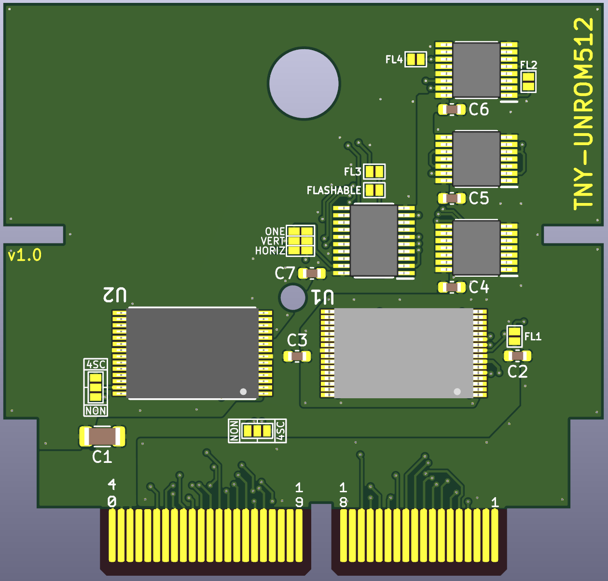

# TNY-UNROM512

This is a custom UNROM512 board for the TinyTendo handheld console by <a href="https://github.com/Redherring32">Redherring32</a>. This board replicates <a href="https://www.nesdev.org/wiki/UNROM_512">standard UNROM 512 NES boards</a>. 

Since these boards use the 39SF040 for the PRG ROM, you should use FamiROM or some other utility to duplicate the ROM files to completely fill up the entire space on the Flash chip if necessary.

# TNY-UNROM512 Board Characteristics

- Thickness: 1.6 mm
- Surface Finish: ENIG
- Chamfered edges (45°)

# How to Use This Board

*Note: Do not solder U1 to the board before programming it.*

UNROM512 games require every component on the board.

The solder jumpers must be bridged according to the NES game you program.

## Flashing the Game

Prepare the ROM using FamiROM or other similar program, ensuring the entire 4Mbit space is filled for the PRG component. You then need to program the 39SF040 before soldering it to the board. I use a <a href="https://www.embeddedcomputers.net/products/FlashcatUSB_XPORT/">FlashCat</a> with a <a href="https://www.embeddedcomputers.net/products/ParallelAdapters/">TSOP-32 adapter (Type B)</a> to achieve this.

# Bill of Materials

Capacitors should be at least 16V rated.

| Reference Designator  | Part Number/Value | Footprint  |
| ------------- | ------------- | ------------- |
| C1  | 22 uF | 1206  |
| C2-C7  | 0.1 uF | 0603  |
| U1  | <a href="https://www.mouser.com/ProductDetail/Microchip-Technology/SST39SF040-70-4C-WHE?qs=Oo69DRhzroe%2FJKrgAmUE5Q%3D%3D">39SF040</a>  | TSOP32 (14mm) |
| U2  | <a href="https://www.mouser.com/ProductDetail/Alliance-Memory/AS6C6264-55STCN?qs=LD2UibpCYJonFY2RVods7g%3D%3D">AS6C6264</a> or <a href="https://www.mouser.com/ProductDetail/870-IS61C64AL-10TLI">IS61C64AL-10TLI</a>  | TSOP28 |
| U3  | <a href="https://www.mouser.com/en/ProductDetail/Texas-Instruments/SN74HC32PWR?qs=ZA235jQDfbp291NIbGpFPA%3D%3D&srsltid=AfmBOoqr3tJiAp05AKdq0nheTTSW8kXJ8rZ0H6d5TP8TUHp8teFPOZYZ">SN74HC32PWR</a>              | TSSOP14 |
| U4  | <a href="https://www.mouser.com/en/ProductDetail/Texas-Instruments/SN74HC32PWR?qs=ZA235jQDfbp291NIbGpFPA%3D%3D&srsltid=AfmBOoqr3tJiAp05AKdq0nheTTSW8kXJ8rZ0H6d5TP8TUHp8teFPOZYZ">SN74HC32PWR</a>              | TSSOP14 |
| U5  | <a href="https://www.mouser.com/en/ProductDetail/Texas-Instruments/SN74HC139PWR?qs=%252BWCn1GN4mVzsIRktqzW%252B6w%3D%3D">SN74HC139PWR</a>              | TSSOP16 |
| U6  | <a href="https://www.mouser.com/en/ProductDetail/Texas-Instruments/SN74HC377DWR?qs=VolsR0DjNPqmUtsQyZQkhw%3D%3D">SN74HC377DWR</a>              | SOIC20 |

# Revision History

## v1.0

- Initial version

## License
 This work is licensed under a <a rel="license" href="http://creativecommons.org/licenses/by-sa/4.0/">Creative Commons Attribution-ShareAlike 4.0 International License</a>. You are able to copy and redistribute the material in any medium or format, as well as remix, transform, or build upon the material for any purpose (even commercial) - but you **must** give appropriate credit, provide a link to the license, and indicate if any changes were made.

## Credits

*Redherring32* - Creating the TinyTendo project.

*BucketMouse* - Original MMC3 and NROM cartridge designs for TinyTendo which this is an extension of.

*NESDev* - Wiki was heavily referenced as part of writing the schematic and troubleshooting.